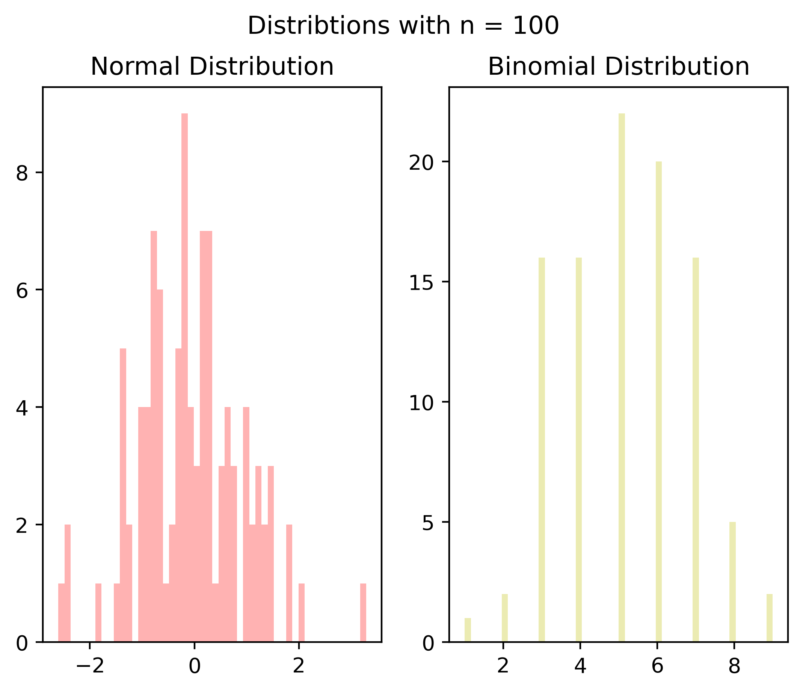

```python
import numpy as np
import pandas as pd
import matplotlib.pyplot as plt
from pandas import Series, DataFrame
```


```python
small_n_b = np.random.binomial(10,.5,100)
small_n_n = np.random.normal(size = (100,1))

med_n_b = np.random.binomial(100,.5,1000)
med_n_n = np.random.normal(size = (1000,1))

large_n_b = np.random.binomial(100,.5,10000)
large_n_n = np.random.normal(size = (10000,1))
```


```python
fig_small =  plt.figure()

ax1 = fig_small.add_subplot(1,2,1)
ax2 = fig_small.add_subplot(1,2,2)

ax1.hist(small_n_n, bins = 50, color = 'r', alpha = .3)
ax1.set_title('Normal Distribution')

ax2.hist(small_n_b, bins = 50, color = 'y', alpha =.3)
ax2.set_title('Binomial Distribution')

fig_small.suptitle('Distribtions with n = 100')

plt.savefig('small_n.png', dpi=400, bbox_inches='tight')
```


    

    


```python
fig_med =  plt.figure()

ax1 = fig_med.add_subplot(1,2,1)
ax2 = fig_med.add_subplot(1,2,2)

ax1.hist(med_n_n, bins = 50, color = 'r', alpha = .3)
ax1.set_title('Normal Distribution')

ax2.hist(med_n_b, bins = 100, color = 'y', alpha =.3)
ax2.set_title('Binomial Distribution')

fig_small.suptitle('Distribtions with n = 100')

plt.savefig('med_n.png', dpi=400, bbox_inches='tight')
```


    

    


```python
fig_lrg =  plt.figure()

ax1 = fig_lrg.add_subplot(1,2,1)
ax2 = fig_lrg.add_subplot(1,2,2)

ax1.hist(large_n_n, bins = 50, color = 'r', alpha = .3)
ax1.set_title('Normal Distribution')

ax2.hist(large_n_b, bins = 100, color = 'y', alpha =.3)
ax2.set_title('Binomial Distribution')

fig_small.suptitle('Distribtions with n = 100')

plt.savefig('large_n.png', dpi=400, bbox_inches='tight')
```


    

    


```python

```
