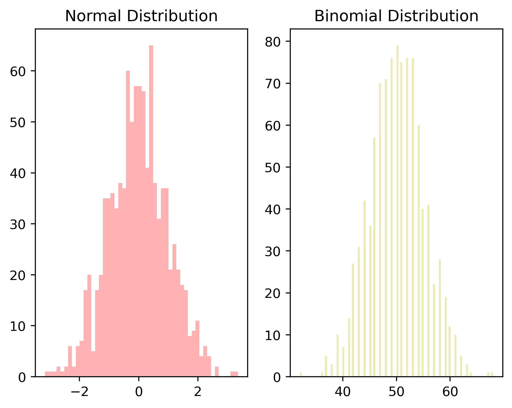
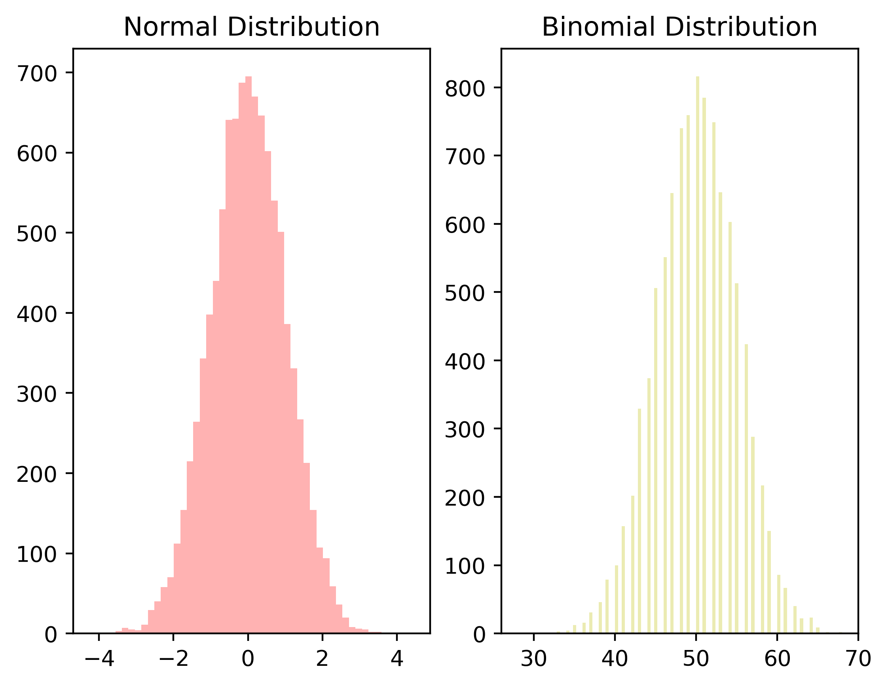

Binomial and Normal Distributions converge with large Ns
================

This is a short presentation on how as the number of observations *n*
increases a binomial distribution approaches the normal distribution


First we add the needed libraries, we use numpty and matplot for this.
```python
import numpy as np
import pandas as pd
import matplotlib.pyplot as plt
from pandas import Series, DataFrame
```

Now we generate the random numbers for different size *n*
```python
small_n_b = np.random.binomial(10,.5,100)
small_n_n = np.random.normal(size = (100,1))

med_n_b = np.random.binomial(100,.5,1000)
med_n_n = np.random.normal(size = (1000,1))

large_n_b = np.random.binomial(100,.5,10000)
large_n_n = np.random.normal(size = (10000,1))
```

This is an example of code to generate a histogram for small *n*
```python
fig_small =  plt.figure()

ax1 = fig_small.add_subplot(1,2,1)
ax2 = fig_small.add_subplot(1,2,2)

ax1.hist(small_n_n, bins = 50, color = 'r', alpha = .3)
ax1.set_title('Normal Distribution')

ax2.hist(small_n_b, bins = 50, color = 'y', alpha =.3)
ax2.set_title('Binomial Distribution')

fig_small.suptitle('Distribtions with n = 100')

plt.savefig('small_n.png', dpi=400, bbox_inches='tight')
```


    

    


### Using similar code we generate plots for *n* = 1000.


    

    

### and *n* = 10000.
    

    


#### It is clear that as *n* approaches *N* a binomial distribution approaches a normal distribution.
