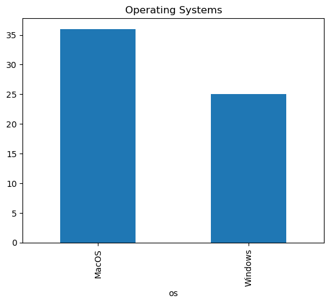
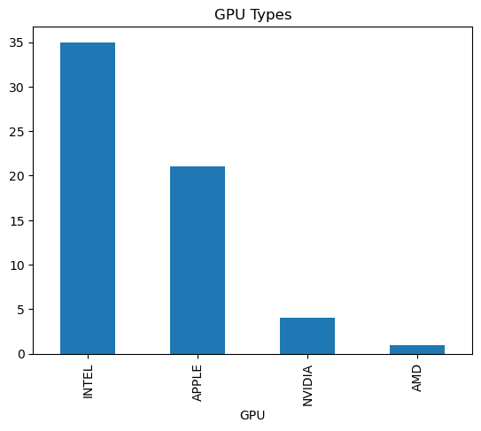
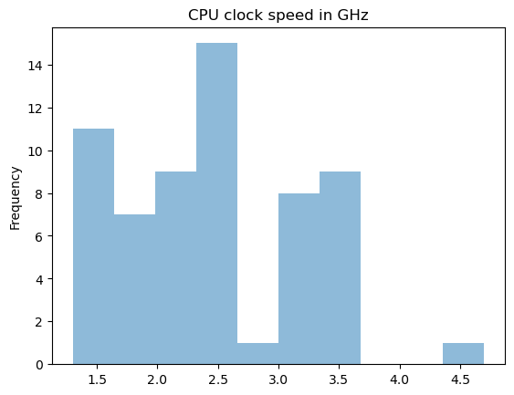
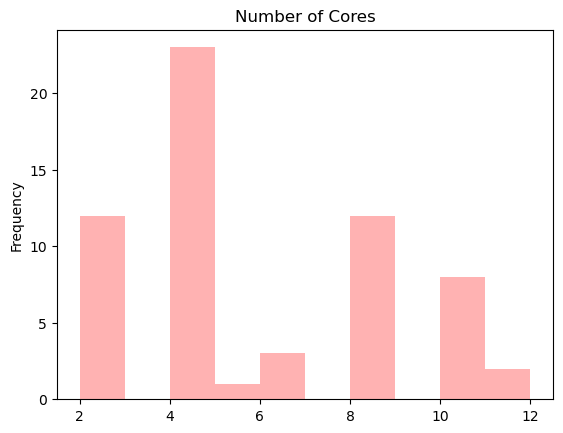
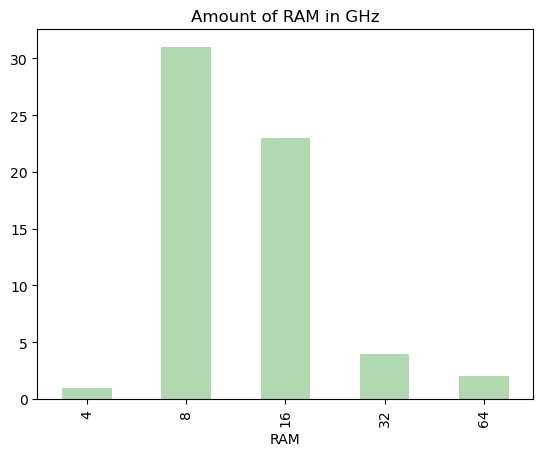
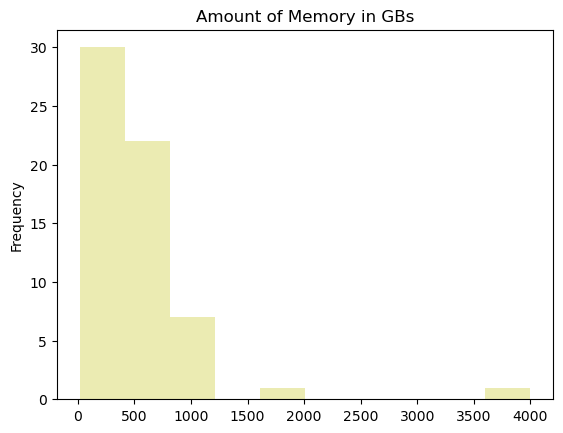

```python
import numpy as np
import pandas as pd
import matplotlib.pyplot as plt
from pandas import Series, DataFrame
```


```python
df = pd.read_csv("2023-06-13-survey.csv")
```


```python
df = df.rename(columns={'Operating System': 'os', 'CPU Cycle Rate (in GHz)':'CPU', 'CPU Number of Cores (int)': 'cores', 'RAM (in GB)':'RAM', 'Hard Drive Size (in GB)':'Memory','GPU (short description as a string)': 'GPU', 'GPU CUDA Number of Cores (int)':'CODA'})
df.pop('Timestamp')

df
               
```


<div>
<style scoped>
    .dataframe tbody tr th:only-of-type {
        vertical-align: middle;
    }

    .dataframe tbody tr th {
        vertical-align: top;
    }

    .dataframe thead th {
        text-align: right;
    }
</style>
<table border="1" class="dataframe">
  <thead>
    <tr style="text-align: right;">
      <th></th>
      <th>os</th>
      <th>CPU</th>
      <th>cores</th>
      <th>RAM</th>
      <th>Memory</th>
      <th>GPU</th>
      <th>CODA</th>
    </tr>
  </thead>
  <tbody>
    <tr>
      <th>0</th>
      <td>Windows</td>
      <td>3.0</td>
      <td>8</td>
      <td>16</td>
      <td>935</td>
      <td>NVIDIA</td>
      <td>5888</td>
    </tr>
    <tr>
      <th>1</th>
      <td>MacOS</td>
      <td>3.2</td>
      <td>8</td>
      <td>8</td>
      <td>256</td>
      <td>APPLE</td>
      <td>8</td>
    </tr>
    <tr>
      <th>2</th>
      <td>MacOS</td>
      <td>3.6</td>
      <td>12</td>
      <td>32</td>
      <td>1000</td>
      <td>APPLE</td>
      <td>38</td>
    </tr>
    <tr>
      <th>3</th>
      <td>Windows</td>
      <td>2.3</td>
      <td>8</td>
      <td>16</td>
      <td>500</td>
      <td>NVIDIA</td>
      <td>2560</td>
    </tr>
    <tr>
      <th>4</th>
      <td>Windows</td>
      <td>3.3</td>
      <td>4</td>
      <td>16</td>
      <td>475</td>
      <td>NVIDIA</td>
      <td>2560</td>
    </tr>
    <tr>
      <th>...</th>
      <td>...</td>
      <td>...</td>
      <td>...</td>
      <td>...</td>
      <td>...</td>
      <td>...</td>
      <td>...</td>
    </tr>
    <tr>
      <th>56</th>
      <td>Windows</td>
      <td>2.5</td>
      <td>2</td>
      <td>8</td>
      <td>237</td>
      <td>INTEL</td>
      <td>0</td>
    </tr>
    <tr>
      <th>57</th>
      <td>MacOS</td>
      <td>2.3</td>
      <td>2</td>
      <td>8</td>
      <td>256</td>
      <td>APPLE</td>
      <td>0</td>
    </tr>
    <tr>
      <th>58</th>
      <td>MacOS</td>
      <td>2.3</td>
      <td>2</td>
      <td>8</td>
      <td>500</td>
      <td>APPLE</td>
      <td>0</td>
    </tr>
    <tr>
      <th>59</th>
      <td>Windows</td>
      <td>1.8</td>
      <td>5</td>
      <td>8</td>
      <td>224</td>
      <td>INTEL</td>
      <td>5</td>
    </tr>
    <tr>
      <th>60</th>
      <td>MacOS</td>
      <td>2.3</td>
      <td>2</td>
      <td>8</td>
      <td>250</td>
      <td>INTEL</td>
      <td>0</td>
    </tr>
  </tbody>
</table>
<p>61 rows × 7 columns</p>
</div>


```python
df['os'].value_counts().plot.bar(title = 'Operating Systems')
```


    <Axes: title={'center': 'Operating Systems'}, xlabel='os'>


    

    


```python
df['GPU'].value_counts().plot.bar(title = 'GPU Types')
```


    <Axes: title={'center': 'GPU Types'}, xlabel='GPU'>


    

    


```python
df['CPU'].plot.hist(alpha = .5, title = 'CPU clock speed in GHz')
```


    <Axes: title={'center': 'CPU clock speed in GHz'}, ylabel='Frequency'>


    

    


```python
df['cores'].plot.hist(color = 'r', alpha = .3, title = 'Number of Cores')
```


    <Axes: title={'center': 'Number of Cores'}, ylabel='Frequency'>


    

    


```python
df['RAM'].value_counts().sort_index().plot.bar(color = 'g', alpha = .3, title = 'Amount of RAM in GHz')
```


    <Axes: title={'center': 'Amount of RAM in GHz'}, xlabel='RAM'>


    

    


```python
df['Memory'].plot.hist(color = 'y', alpha = .3, title = 'Amount of Memory in GBs')
```


    <Axes: title={'center': 'Amount of Memory in GBs'}, ylabel='Frequency'>


    

    

