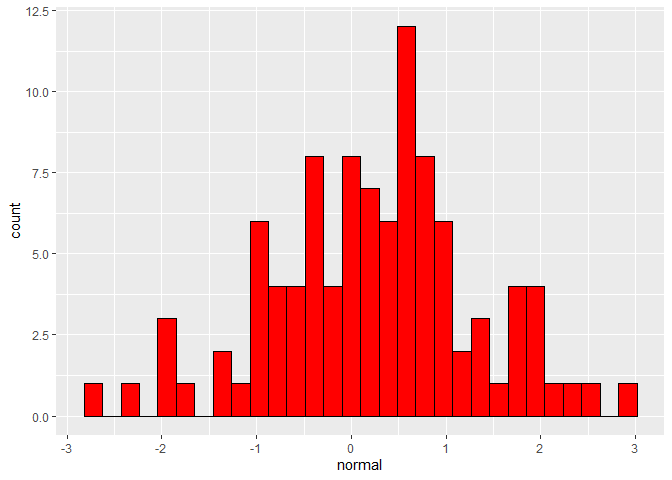

Binomial and Normal Distributions converge with large Ns
================

This is a short presentation on how as the number of observations *n*
increases a binomial distribution approaches the normal distribution

``` r
library(tidyverse)
```

First we need to create a data frame with all the data needed for
comparison. I have created three different data frames for the different
number of observations

``` r
small_n <- tibble(
  
  normal = rnorm(100),
  bi_nomial = rbinom(100,5,.5)
  
)

med_n <- tibble(
  
  normal = rnorm(1000),
  bi_nomial = rbinom(1000,50,.5)
  
)

large_n <- tibble(
  
  normal = rnorm(10000),
  bi_nomial = rbinom(10000,500,.5)
  
)
```

Next we need to run some *R* code to generate the different plots. For
example the following code generates a histogram for the normal
distribution in small *n*.

``` r
ggplot(small_n, aes(x = normal))+
  geom_histogram(fill = 'red', color = 'black')
```

<figure>

<figcaption aria-hidden="true">nomal distribution with n =
100</figcaption>
</figure>

Using similar code we can create histograms for different *n* sizes. As
*n* approaches *N* we can see that the binomial distribution approaches
the normal distribution.

<div class="figure">


<p class="caption">
n=100
</p>

</div>

<div class="figure">


<p class="caption">
n=1000
</p>

</div>

<div class="figure">


<p class="caption">
n=10000
</p>

</div>

#### It is clear that as *n* approaches *N* a binomial distribution approaches a normal distribution.
