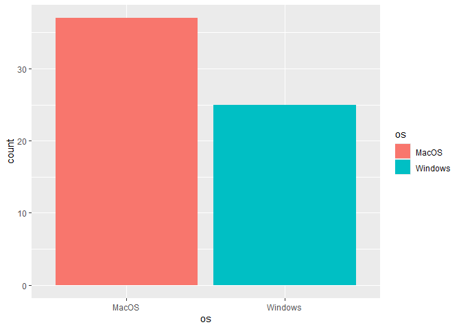
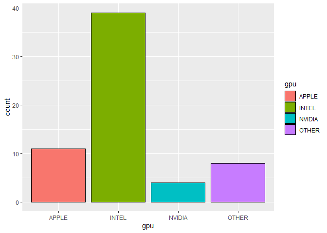
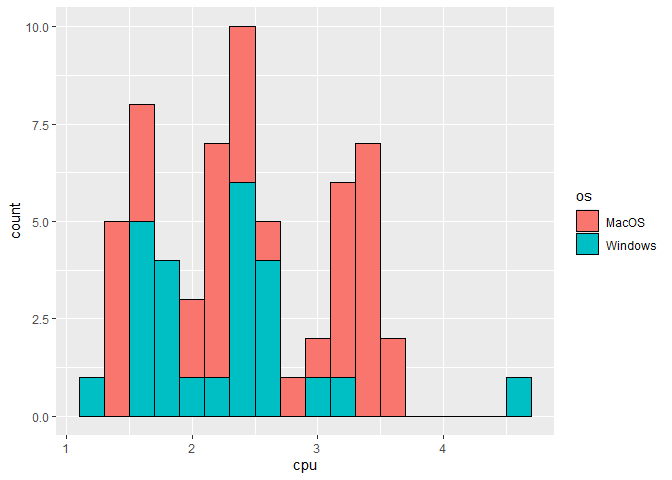
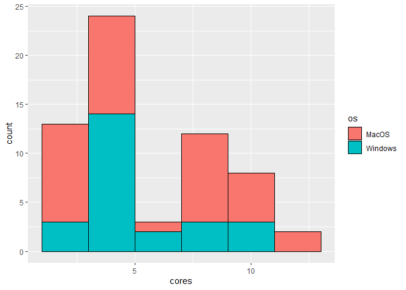
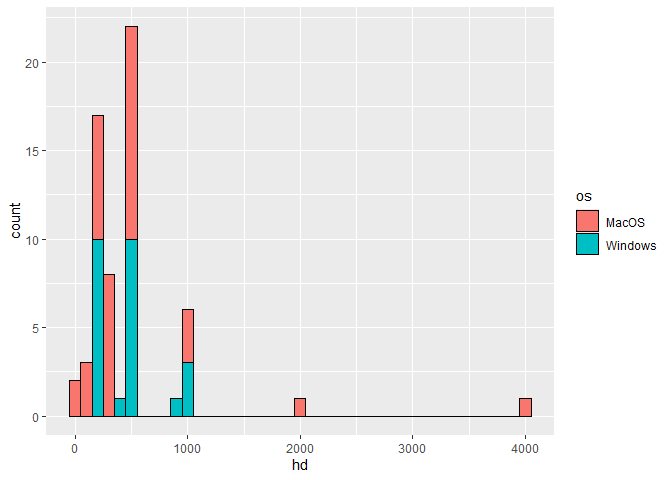
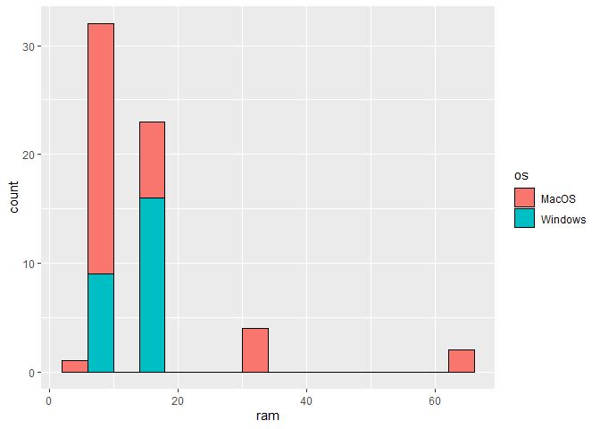

Class Data
================
Patrick Foster

## Fall 24 MSDS Computer Data

The following graphs are pulled from the data set. The first two are the
qualitative data sets that could not be captured with a histogram.

Operating System and Gpus for the cohort

The next two graphs are some histograms on about the CPU data for the
computers in the cohort, mainly their clock speed in GHz and the number
of cores.

CPU and the number of cores

Finally we have some histograms on the amount the amount of memory each
computer has, both is strorage and RAM

HD space and RAM

